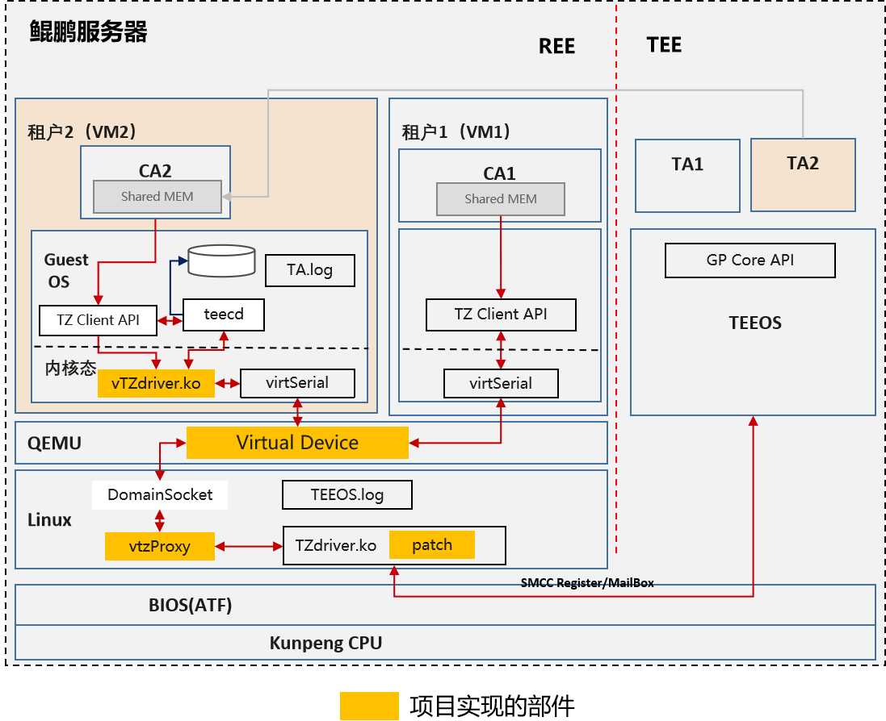

# trustzone-awared-vm

#### 介绍

项目（tee-gp-proxy）旨在通过各种手段，使得REE侧的CA可以在各种场景中使用TrustZone，包括RPC调用方式，以及在虚拟化场景下对TrustZone的访问。 

#### 软件架构

本项目拟借助qemu虚拟串口 virtserial、充分利用内存拷贝与内存共享，构建TrustZone感知的机密虚拟机，其整体架构如图 所示。构建vtzdriver，提供与tzdriver相同的接口供上层应用和库调用。利用qemu提供的virtserial，在VM侧创建字符设备，在Host侧创建socket，连通VM与Host。vtz_proxy接受识别由vtzdriver转发的tzdriver调用，识别后调用tzdriver对应接口。调用结果由vtz_proxy、qemu、vtzdriver返回给上层应用。从而实现在VM中使用TEE的体验与本地Host上无差异。

#### 安装教程

参考部署文档。

#### 使用说明

1. 本项目不包含其它开源项目的代码，涉及的第三方开源组件均需要使用者自行获取。

#### 参与贡献

#### 特技

1. 项目提供接口与原接口完全适配，用户无需修改应用
2. 支持虚拟机使用switchless特性