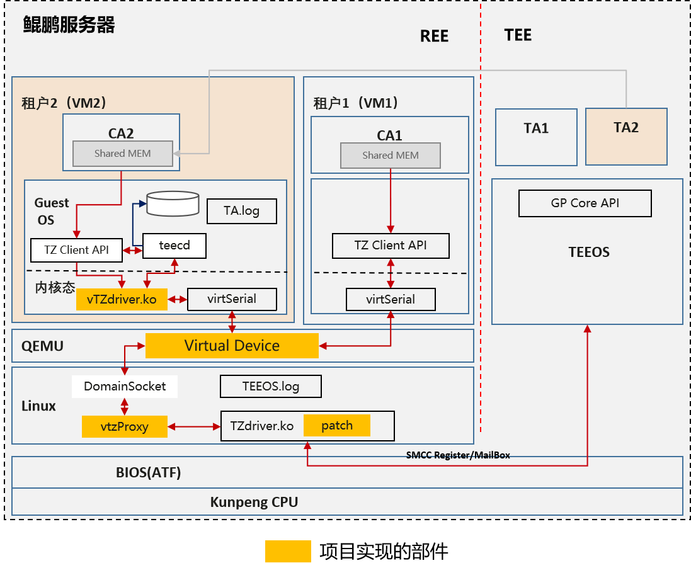

# trustzone-awared-vm

## 介绍

项目（trustzone-awared-vm）旨在通过各种手段，使得REE侧的CA可以在虚拟化场景下使用TrustZone。 

## 软件架构



本项目借助qemu虚拟串口 virtserial、充分利用内存拷贝与内存共享，构建TrustZone感知的机密虚拟机，其整体架构如图 所示。构建vtzdriver，提供与tzdriver相同的接口供上层应用和库调用。利用qemu提供的virtserial，在VM侧创建字符设备，在Host侧创建socket，连通VM与Host。vtz_proxy接受识别由vtzdriver转发的tzdriver调用，识别后调用tzdriver对应接口。调用结果由vtz_proxy、qemu、vtzdriver返回给上层应用。从而实现在VM中使用TEE的体验与本地Host上无差异。

## 使用说明

1. 本项目不包含其它开源项目的代码，涉及的第三方开源组件均需要使用者自行获取。

## 参与贡献

## 特技

1. 项目提供接口与原接口完全适配，用户无需修改应用
2. 支持虚拟机使用switchless特性

---
---
# 环境搭建
本项目为鲲鹏多种型号服务器提供了host和vm环境部署脚本，详见`utils/ccos-env-deploy`。以下为手动部署的详细操作说明。

## 前置要求

手动部署之前，请确保满足以下条件：

### 必需文件准备

将 `vtzb_proxy.conf` 放置在 `/var/vtzb/` 目录下

### 配置文件

`vtzb_proxy.conf`为 `vtz_proxy` 的配置文件，可在其中定义了socket_path，最大虚机数量等参数，详细信息如下：

- `socket_path`：虚拟串口路径前缀

- `max_vm_count`：支持的最大虚机数量

- `libvirt_uri`：`libvirt` 连接的虚拟uri

- `numa_bindings`：`vtz_proxy` 线程池绑核配置

## Host 环境搭建

1. 安装依赖
    ```shell
    yum install gcc patch make  kernel-devel-$(uname -r) ninja-build
    yum install glib2 glib2-devel pixman-devel
    yum install openssl-devel
    yum install libxml2-devel libvirt-devel
    ```
2. `vtzb_proxy`编译
    ```shell
    git clone https://gitcode.com/openeuler/tee-gp-proxy.git
    git clone https://gitcode.com/openeuler/libboundscheck.git
    cp -rf libboundscheck tee-gp-proxy/trustzone-awared-vm/Host/vtzb_proxy
    ```
   
    1. 编译
        ```shell
        cd tee-gp-proxy/trustzone-awared-vm/Host/vtzb_proxy
        make
        sudo cp ./vtz_proxy /usr/bin/vtz_proxy
        ```	
5. `tzdriver`和`client`编译安装
    1. 进入`itrustee_tzdriver`的根目录，补丁文件路径按照实际路径修改。
    ``` 
    git am ../tee-gp-proxy/trustzone-awared-vm/Host/tzdriver-00*.patch
    ```
    2. 进入`itrustee_client`的根目录，补丁文件路径按照实际路径修改。
    ```shell 
    git am ../tee-gp-proxy/trustzone-awared-vm/Host/client-0001-add-vm-uid-in-TC_NS_ClientContext.patch
    ```
    3. 920 机型请参考[官方文档](https://www.hikunpeng.com/document/detail/zh/kunpengcctrustzone/trustzone/fg/kunpengtrustzone_20_0019.html)。
    4. 920 新型号请参考[官方文档](https://www.hikunpeng.com/document/detail/zh/kunpengcctrustzone/cca/devg/Kunpeng_ommercialcryptography_16_0015.html)
    5. 在`tzdriver`编译后，将`tzdriver.ko` 复制到指定目录
        ```shell 
        mkdir -p "/lib/modules/$(uname -r)/kernel/drivers/trustzone/"
        cp tzdriver.ko /lib/modules/$(uname -r)/kernel/drivers/trustzone
        ```
## qemu与虚机配置
1.	获取`qemu v6.2.0`源码
    ```shell
    git clone -b v6.2.0 https://git.qemu.org/git/qemu.git
    ```
4. 应用补丁文件
    1. 进入目标目录 `qemu` 的根目录，补丁文件路径按照实际路径修改。
    ```shell
    git am ../tee-gp-proxy/trustzone-awared-vm/Host/qemu-00*.patch
    ```
5. 编译`qemu`
    ```shell
    cd qemu
    mkdir build
    cd build
    ../configure --target-list=aarch64-softmmu --disable-werror
    make -j
    ```
    > 注*：关于./configure这一步
    >
    > 1.若出现GCC将warning视为error的报错，可通过 --disable-werror解决
    >
    > 2.若提示gcc版本过低， 请升级gcc版本后再编译
6. 虚拟机镜像
    1. [openEuler22.03-LTS-SP4下载地址](https://repo.openeuler.org/openEuler-22.03-LTS-SP4/virtual_machine_img/aarch64/)
    2. [kylin-v10 qcow2镜像制作方法](docs/kylin-v10-qcow2/kylin-v10-qcow2.md)
7. 虚机配置请参考[虚机配置](docs/vm-libvirt.xml)
8. 定义并启动虚拟机
    1. 安装依赖：
        ```shell
        yum -y install edk2-aarch64.noarch libvirt
        ```
    2. 启动虚机
        ```shell
        systemctl start/restart libvirtd.service
        setenforce 0
        virsh define vm-libvirt.xml
        virsh start nvm-ta-1
        /* 若新安装，用VNC登录安装，注意打开端口防火墙 */
        iptables -I INPUT -p tcp –dport 5901 -j ACCEPT
        ```
9. 多虚机配置
    ```xml
     <qemu:arg value='-chardev'/>
     <qemu:arg value='socket,path=/var/vtzb/vm_vtzb_sock1,server=on,wait=off,id=vm01_vtzb_sock'/>
     <qemu:arg value='-device'/>
     <qemu:arg value='virtio-serial'/>
     <qemu:arg value='-device'/>
     <qemu:arg value='virtserialport,chardev=vm01_vtzb_sock,name=vtzf_serialport0'/>
    ```
    1. 在虚机配置文件中修改如上代码：`path`按照`/var/vtzb/vm_vtzb_sock0`，`/var/vtzb/vm_vtzb_sock1`，`/var/vtzb/vm_vtzb_sock2`且接着上一个虚机配置文件中的`path`有序递增，且数字不能大于配置文件中的 `max_vm_count`
    2. 修改`id`与`chardev` 一致且唯一
    3. `name` 恒为`vtzf_serialport0`
## VM环境搭建
1. 安装依赖
    ```shell
    yum install make kernel-devel-$(uname -r) git gcc openssl-devel 
    ```
2. 下载`tee-gp-proxy`仓库，其中包含`vtzdriver`与`virtio`(5.10内核)源码。
    ```
    git clone https://gitcode.com/openeuler/tee-gp-proxy.git
    git clone https://gitcode.com/openeuler/libboundscheck.git
    cp -rf libboundscheck tee-gp-proxy/trustzone-awared-vm/VM/vtzdriver
    ```
3. `itrustee_client`编译安装
    1. 进入`itrustee_client`的根目录，补丁文件路径按照实际路径修改。
        1. ``` git am ../tee-gp-proxy/trustzone-awared-vm/Host/client-00*.patch```
    2. 920 机型请参考[官方文档](https://www.hikunpeng.com/document/detail/zh/kunpengcctrustzone/trustzone/fg/kunpengtrustzone_20_0019.html)。
    3. 920 新型号请参考[官方文档](https://www.hikunpeng.com/document/detail/zh/kunpengcctrustzone/cca/devg/Kunpeng_ommercialcryptography_16_0015.html)
4. 编译`virtio_console.ko`并加载（仅5.10内核需要执行此步骤）
    1. 编译`virtio_console` 并替换内核默认的`virtio_console`！
    ```shell
    cd tee-gp-proxy/trustzone-awared-vm/VM/virtio/char
    make
    mkdir -p /lib/modules/$(uname -r)/kernel/drivers/trustzone
    cp virtio_console.ko /lib/modules/$(uname -r)/kernel/drivers/trustzone
    rmmod virtio_console
    insmod /lib/modules/$(uname -r)/kernel/drivers/trustzone/virtio_console.ko
    ```
5. 编译`vtzdriver`并加载`vtzfdriver.ko`, `vtzfdriver`加载后不可卸载, 如需卸载请重启
    ```shell
    cd tee-gp-proxy/trustzone-awared-vm/VM/vtzdriver
    make
    mkdir -p /lib/modules/$(uname -r)/kernel/drivers/trustzone
    cp vtzfdriver.ko /lib/modules/$(uname -r)/kernel/drivers/trustzone
    insmod /lib/modules/$(uname -r)/kernel/drivers/trustzone/vtzfdriver.ko
    ```
    > 如果是麒麟系统，需要在Makefile中 删除 `-fstack-protector-strong`
    >
    > 若kernel路径不正确，请自行修改Makefile中的KERN_DIR

## 开始运行
首先要确认`Host`与`VM`中已搭建好`ccos`环境，然后每次重启后需执行以下命令：
#### 在`Host`中需要执行以下命令
```shell
insmod /lib/modules/$(uname -r)/kernel/drivers/trustzone/tzdriver.ko
nohup /usr/bin/teecd &
nohup /usr/bin/vtz_proxy &
```
#### 在`VM`中需要执行以下命令

1. 重新加载`virtio_console`模块（仅5.10内核需要执行此步骤）
```shell
rmmod virtio_console
insmod /lib/modules/$(uname -r)/kernel/drivers/trustzone/virtio_console.ko
```
2. 加载`vtzfdriver.ko`和`teecd`
```bash
insmod /lib/modules/$(uname -r)/kernel/drivers/trustzone/vtzfdriver.ko
nohup /usr/bin/teecd &
```

## 故障恢复
1. `vtz_proxy` 优雅退出：
    1. 需要再次拉起`vtz_proxy`，然后在所有`VM`内手动终止正在执行的`CA`进程，并进行如下操作：
    ```
    kill -9 $(pgrep teecd)
    rmmod vtzfdriver.ko 
    insmod vtzdriver.ko
    nohup /usr/bin/teecd &
    ```
    2. 最后再重新拉起CA进程。
2. `vtz_proxy` 强制退出：
	1. 需要再次拉起`vtz_proxy` 进程，重启所有`VM`，并重新初始化环境。
