### 环境准备

虚拟机镜像的制作在物理机上进行，需安装libvirt和qemu。除此之外还需要一些能修改镜像的工具和虚拟化的辅助软件。建议在openEuler操作系统上制作镜像，在安装虚拟化软件时更加方便。接下来的操作以openEuler2203-sp4-aarch64系统举例。

1. 安装libstdc++
    ```bash
    yum install libstdc++
    ```
2. 安装qemu和相关工具
    ```bash
    yum install qemu qemu-img qemu-kvm libvirt virt-install 
    ```
3. 安装guestfish
    ```bash
    yum install guestfish
    ```
    **注意**：如果报错提示没有guestfish就不用安装这一个
    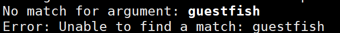
4. 安装libguestfs-tools
    ```bash
    yum install libguestfs-tools
    ```
5. 验证
    ```bash
    virsh version
    ```
    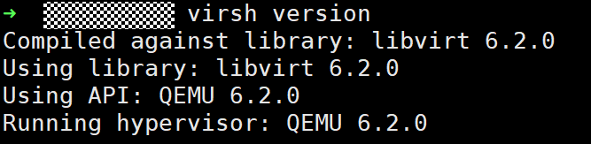
6. 开启ipv4转发功能
    ```bash
    sysctl -w net.ipv4.ip_forward=1
    ```
    虚拟机在安装软件时需要联网，可以以NAT方式连接。使用NAT方式可以使KVM的虚拟机快速联网，在虚拟机启动后修改网卡文件中的ONBOOT=yes，然后执行service network restart即可联网，同时虚拟机和宿主机可以互相ping通。

### 制作镜像

1. 准备kylin-v10的iso文件，以kylin-v10-sp3-arm64为例，将其放在/root目录下。

2. 创建镜像文件
    ```bash
    qemu-img create -f qcow2 /root/kylin-v10-sp3-arm64.qcow2 40G
    ```
    - `qemu-img`：`qemu`的磁盘镜像管理工具，用于创建、转化和管理虚拟机磁盘镜像
    - `create`：子命令，表示创建新的磁盘镜像
    - `-f qcow2`：指定镜像格式为`qcow2`
    - `/root/kylin-v10-sp3-arm64.qcow2`：指定创建的镜像文件的路径和名称
    - `40G`：指定镜像的虚拟大小

3. 创建虚拟机并安装系统
    ```bash
    virt-install --name kylin-xc --ram 4096 --vcpus 4  --os-type=linux --disk path=/root/kylin-v10-sp3-arm64.qcow2,format=qcow2,device=disk,bus=virtio  --network network=default,model=virtio --cdrom /root/Kylin-Server-V10-SP3-General-Release-2303-ARM64.iso  --graphics vnc,listen=0.0.0.0,port=7890
    ```
    - `--name kylin-xc`：虚拟机名称
    - `--ram 4096`：分配内存4096MB=4G
    - `--vcpus 4`：分配4个虚拟cpu核心
    - `--os-type=linux`：操作系统类型
    - `--disk path= ,format= , device= , bus= ,`：指定qcow2镜像，这里为上一步创建的qcow2镜像
    - `network network= , model= ,`：网络配置，使用默认`libvirt`网络，`virtio`网卡
    - `--cdrom`：安装介质，这里为步骤1中的kylin-v10的iso文件
    - `--graphics vnc, listen= , port= ,`：图形界面，通过vnc远程访问安装界面，监听所有窗口（0.0.0.0），端口7890

    **注意**：如果报错出现iso验证编码问题，可能是`libvirt`出现问题，可以重装或者升级`libvirt`后再次尝试。
    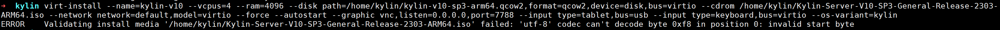
    

4. 使用`vnc`连接进入虚拟机安装操作系统，以MobaXterm为例
    - 进入MobaXterm，点击上方工具栏中`session`
    
    - 选择`vnc`，填写服务器ip和上一条命令的端口号
    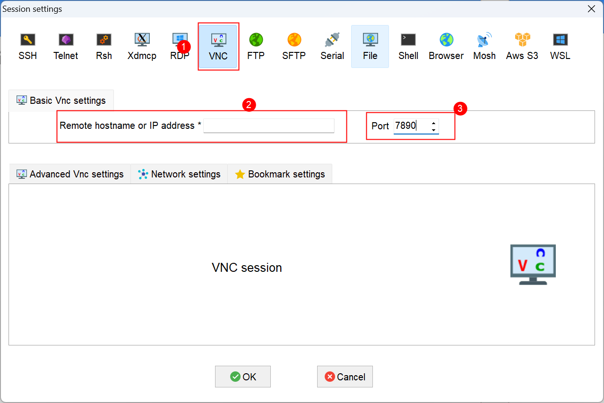
    - 选择语言进入安装界面
    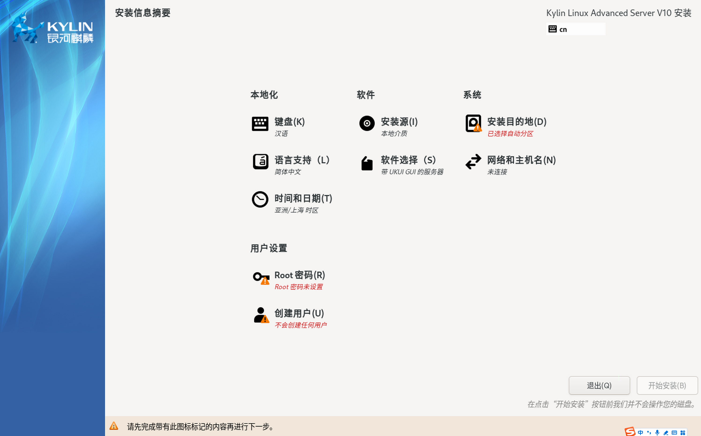
    - 选择安装目的地
    
    - 设置root密码
    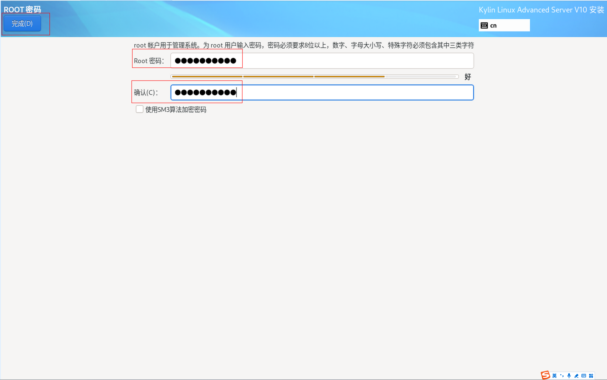
    - 开始安装
    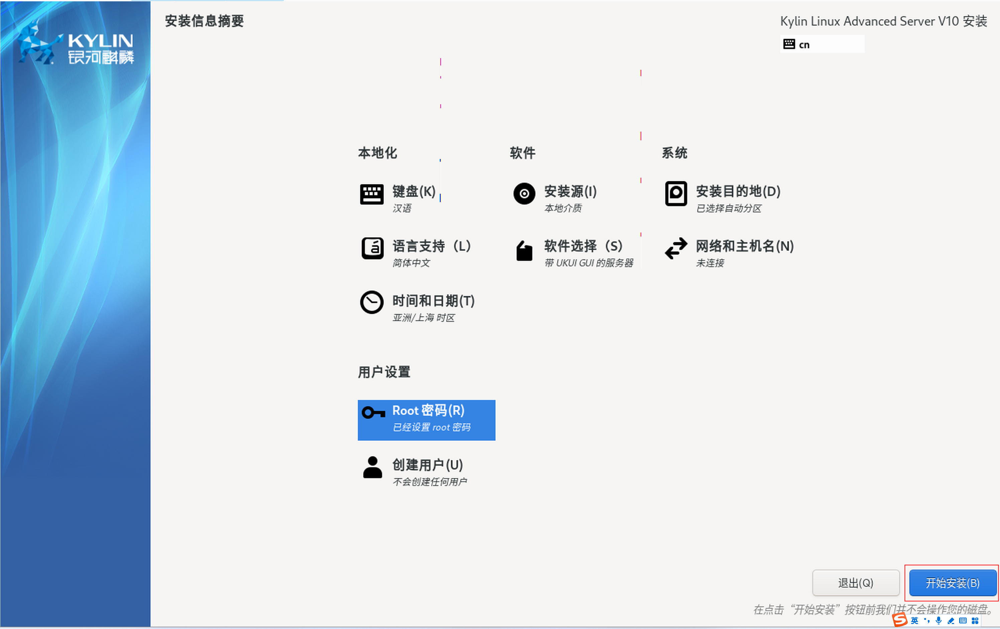
    - 安装完成后点击**重启系统**，
    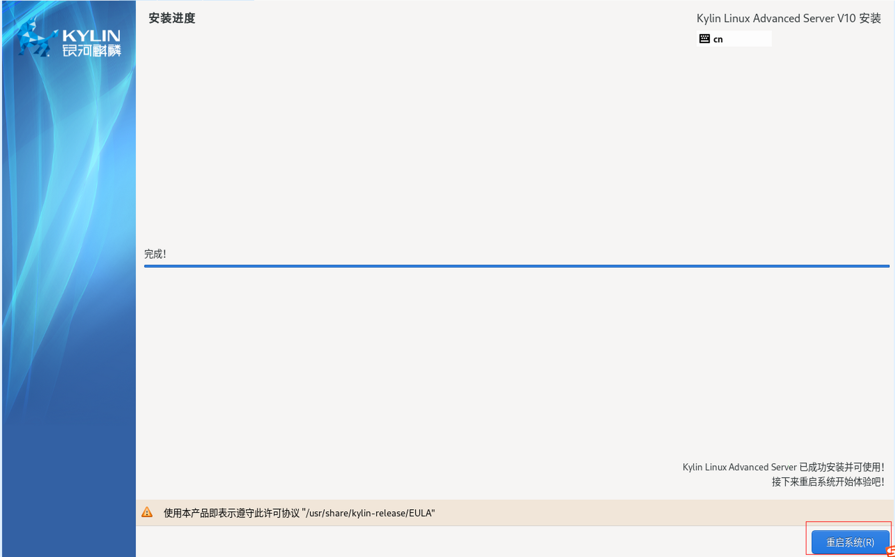
    - 重启之后接受许可，完成配置，退出`vnc`
    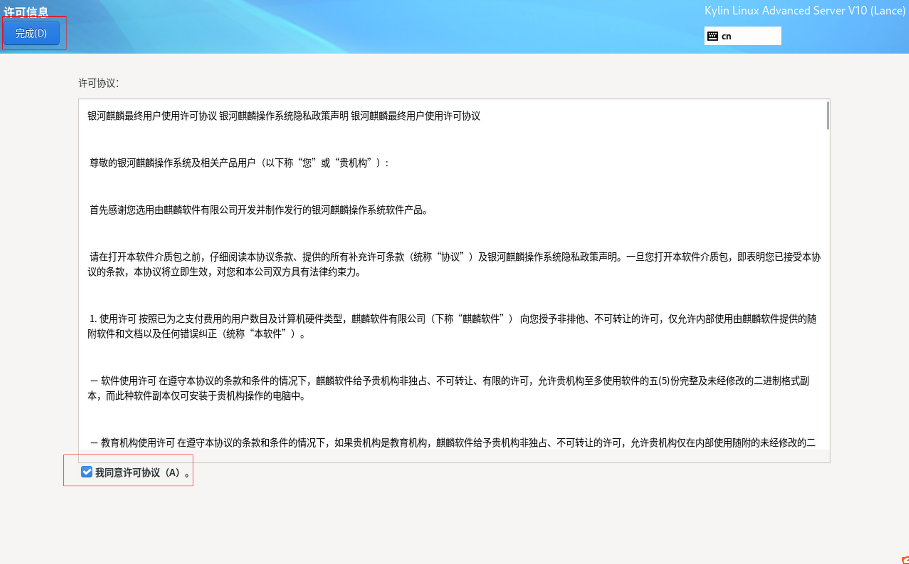
    
5. 重启之后回到服务器，进入虚拟机修改配置
    - 使用下面的命令进入虚拟机，后续命令均在虚拟机上执行
        ```bash
        virsh console kylin-xc # console 后为之前设置的虚拟机的名字
        ```
    - 查看ip
        ```bash
        ip a
        ```
        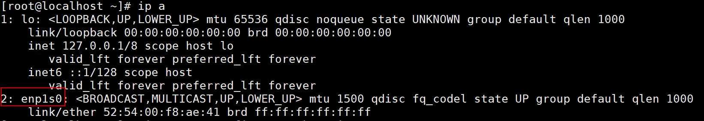
        如果ip没有自动获取到，修改对应接口的配置文件，将ONBOOT修改为yes
        ```bash
        vi /etc/sysconfig/network-scripts/ifcfg-enp1s0
        ```
        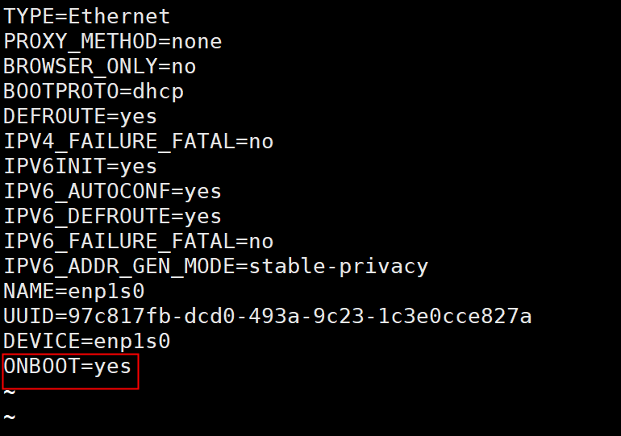
    - 重启network服务，就可以查看到ip，访问外网
        ```bash
        service network restart
        ```
    - 执行以下命令
        ```bash
        yum install -y acpid net-tools

        chkconfig acpid on

        yum install NetworkManager

        chkconfig NetworkManager on

        yum install cloud-init

        echo "NOZEROCONF=yes" >> /etc/sysconfig/network

        sed -i 's/SELINUX=enforcing/SELINUX=disabled/g' /etc/selinux/config

        setenforce 0

        systemctl disable firewalld

        systemctl stop firewalld
        ```
    - 修改sshd_config文件配置
        ```bash
        vi /etc/ssh/sshd_config
        ```
        将`PermitRootLogin`和`PasswordAuthentication`两项修改为yes
    - 关闭虚拟机
        ```bash
        poweroff
        ```

6. 收尾工作

    - 清理虚拟机内的临时数据
        ```bash
        virt-sysprep -d kylin-xc
        ```

    - 压缩镜像，减小体积
        ```bash
        virt-sparsify --compress /root/kylin-v10-sp3-arm64.qcow2 /root/Kylin-v10-sp3-arm64.qcow2
        ```
    **至此，镜像已创建完成，可以创建虚拟机进行验证。**


