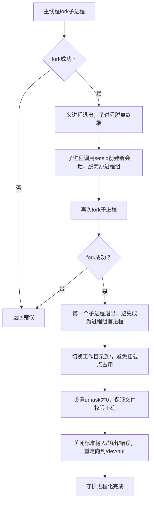
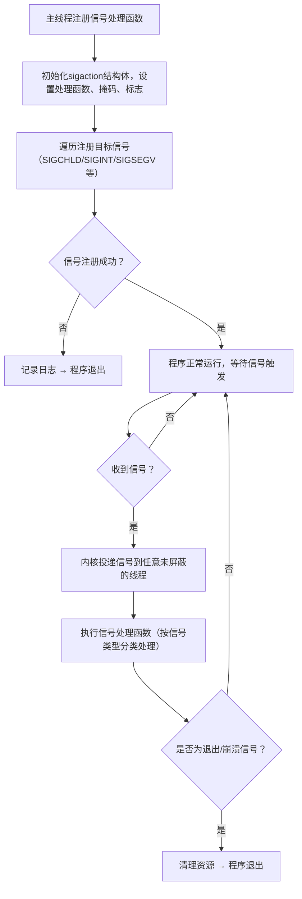

# vtz_proxy 守护进程化与信号处理设计文档
## 1. 文档概述
### 1.1 文档目的
本文档明确 `vtz_proxy` 程序的守护进程化改造及信号处理机制设计方案，解决程序偶现崩溃退出、僵尸进程残留问题，保证程序后台稳定运行、异常可追溯、资源可回收。

### 1.2 适用范围
本文档适用于 `vtz_proxy` 程序的开发、测试及维护人员，指导守护进程化和信号处理模块的实现、验证与运维。

### 1.3 术语定义
| 术语          | 定义                                                                 |
|---------------|----------------------------------------------------------------------|
| 守护进程      | 脱离终端、后台运行的进程，不受终端退出影响，生命周期与系统一致（除非主动终止） |
| 僵尸进程      | 子进程退出后父进程未回收其资源（PID、退出状态），导致进程表残留的无效进程     |
| 信号          | Linux/Unix 进程间通信机制，用于通知进程事件（如异常、退出、子进程状态变化）|
| sigaction     | POSIX 标准信号处理函数，用于注册/修改信号处理规则，替代传统 signal 函数       |
| 异步信号安全  | 信号处理函数中可安全调用的函数，无竞态、无重入风险                         |

## 2. 需求分析
### 2.1 核心问题
- `vtz_proxy` 运行时依赖终端，终端退出导致程序异常终止；
- 程序偶现崩溃（如段错误、非法指令），无崩溃日志，难以定位原因；
- 子进程退出后未被回收，产生僵尸进程，占用系统资源；
- 无优雅退出机制，强制终止时导致资源泄漏（如串口未关闭、内存未释放）。

### 2.2 功能需求
| 需求点                | 描述                                                                 |
|-----------------------|----------------------------------------------------------------------|
| 守护进程化            | 程序脱离终端后台运行，具备标准守护进程特性（脱离会话、重定向文件描述符等）|
| 异常信号捕获          | 捕获崩溃类信号（SIGSEGV/SIGABRT等），记录日志并优雅清理资源           |
| 僵尸进程回收          | 捕获 SIGCHLD 信号，及时回收退出的子进程，避免僵尸进程                 |
| 优雅退出              | 捕获 SIGINT/SIGTERM 信号，触发资源清理后正常退出                     |
| 信号处理健壮性        | 信号处理函数满足异步安全要求，避免二次崩溃                           |
| 多线程兼容            | 主线程注册的信号处理规则可被子线程继承，且不干扰业务逻辑             |

## 3. 设计目标
1. 程序后台稳定运行：守护进程化后脱离终端，不因终端操作终止；
2. 异常可追溯：崩溃时记录信号类型、时间、进程ID等关键日志；
3. 资源无泄漏：异常/正常退出时清理串口、内存、文件描述符等资源；
4. 无僵尸进程：子进程退出后100%被回收，不残留无效PID；
5. 跨平台兼容：优先适配Linux/嵌入式Linux系统，兼顾可移植性；
6. 多线程安全：信号处理不干扰子线程业务逻辑，子线程可独立控制信号掩码。

## 4. 核心设计
### 4.1 守护进程化设计
#### 4.1.1 设计思路
守护进程化的核心是让程序脱离终端、会话依赖，后台独立运行。提供两种实现方案，可根据场景选择：

| 方案                | 实现方式                          | 适用场景                     | 优势                          | 劣势                          |
|---------------------|-----------------------------------|------------------------------|-------------------------------|-------------------------------|
| 自定义 daemonize 函数 | 手动实现 fork→setsid→fork→chdir→umask→关闭文件描述符 | 生产环境/嵌入式Linux         | 可控性高、兼容性好、可加日志  | 代码量稍多                    |
| 调用 daemon(0,0) 函数 | 直接调用系统封装的 daemon 函数    | 测试/快速开发                | 代码简洁、一键实现            | 可控性低、部分嵌入式系统不支持 |

#### 4.1.2 核心流程（自定义方案）


#### 4.1.3 关键设计点
- 两次 fork：第一次脱离终端，第二次避免进程成为会话首进程，防止意外打开终端；
- 重定向文件描述符：将 STDIN/STDOUT/STDERR 重定向到 /dev/null，彻底脱离终端依赖；
- 文件掩码设置：umask(0) 确保程序创建文件时权限符合预期（不受父进程掩码影响）；
- 日志独立存储：守护进程化后标准输出失效，所有日志需写入独立文件（如 /var/log/vtz_proxy.log）。

### 4.2 信号处理设计
#### 4.2.1 设计思路
基于 POSIX 标准的 `sigaction` 函数实现信号处理，替代传统 `signal` 函数，保证跨平台一致性和功能完整性。核心原则：
- 信号处理规则为进程级属性，主线程统一注册，子线程自动继承；
- 信号掩码为线程级属性，子线程可独立修改，避免业务逻辑被信号打断；
- 信号处理函数保证异步安全，仅调用系统级安全函数；
- 分类处理信号：退出信号、崩溃信号、子进程信号、管道错误信号。

#### 4.2.2 信号选型与处理逻辑
| 信号类型       | 信号名称   | 触发场景                     | 处理逻辑                                                                 |
|----------------|------------|------------------------------|--------------------------------------------------------------------------|
| 退出信号       | SIGINT     | 终端Ctrl+C                   | 记录日志 → 置退出标志 → 清理资源 → 正常退出                             |
|                | SIGTERM    | kill命令默认信号             | 同上                                                                     |
| 崩溃信号       | SIGSEGV    | 段错误（非法内存访问）| 记录崩溃日志 → 清理资源 → 异常退出                                       |
|                | SIGABRT    | 程序主动abort/断言失败       | 同上                                                                     |
|                | SIGILL     | 非法指令                     | 同上                                                                     |
|                | SIGFPE     | 浮点异常                     | 同上                                                                     |
| 子进程信号     | SIGCHLD    | 子进程退出/暂停/继续         | 循环调用waitpid回收所有僵尸进程 → 记录子进程退出状态                     |
| 管道错误信号   | SIGPIPE    | 写关闭的管道                 | 记录日志 → 忽略（避免程序崩溃）                                           |

#### 4.2.3 多线程信号处理规则
1. 信号处理函数：进程级全局属性，主线程注册后所有子线程自动继承，任意线程修改会覆盖全局规则；
2. 信号掩码：线程级独立属性，子线程继承主线程初始掩码，可通过 `pthread_sigmask` 独立修改（禁止使用 `sigprocmask`）；
3. 信号投递：
   - 进程级信号（如 SIGINT/SIGCHLD）随机投递到未屏蔽该信号的线程；
   - 异常信号（如 SIGSEGV）仅投递到触发异常的线程；
   - 建议主线程保留核心信号（如 SIGCHLD/SIGTERM）不屏蔽，子线程屏蔽退出信号专注业务逻辑。

#### 4.2.4 核心流程


## 5. 实现细节
### 5.1 模块划分
| 模块名称         | 功能描述                     | 核心函数/接口                |
|------------------|------------------------------|------------------------------|
| 守护进程化模块   | 实现程序后台运行             | daemonize()                  |
| 信号注册模块     | 注册信号处理规则             | register_signal_handlers()   |
| 信号处理模块     | 处理各类信号事件             | signal_handler()             |
| 资源清理模块     | 释放程序占用的资源           | cleanup_resources()          |
| 日志模块         | 异步安全的日志记录           | safe_log()                   |

### 5.2 关键代码实现
#### 5.2.1 守护进程化模块（自定义方案）
```c
/**
 * @brief 自定义守护进程化函数
 * @return 0-成功，-1-失败
 */
static int daemonize(void) {
    // 第一次fork，脱离终端
    pid_t pid = fork();
    if (pid < 0) {
        perror("fork failed");
        return -1;
    }
    if (pid > 0) {
        exit(0); // 父进程退出
    }

    // 创建新会话，脱离原进程组
    if (setsid() < 0) {
        perror("setsid failed");
        return -1;
    }

    // 第二次fork，避免成为进程组首进程
    pid = fork();
    if (pid < 0) {
        perror("fork failed");
        return -1;
    }
    if (pid > 0) {
        exit(0); // 第一个子进程退出
    }

    // 切换工作目录到/
    chdir("/");
    // 设置文件掩码为0
    umask(0);
    // 关闭标准文件描述符
    close(STDIN_FILENO);
    close(STDOUT_FILENO);
    close(STDERR_FILENO);
    // 重定向到/dev/null
    open("/dev/null", O_RDONLY);  // STDIN
    open("/dev/null", O_WRONLY);  // STDOUT
    open("/dev/null", O_WRONLY);  // STDERR

    safe_log("vtz_proxy: daemonize success");
    return 0;
}
```

#### 5.2.2 信号注册模块
```c
/**
 * @brief 注册信号处理函数
 * @return 0-成功，-1-失败
 */
static int register_signal_handlers(void) {
    struct sigaction sa;
    sigemptyset(&sa.sa_mask); // 清空信号掩码
    sa.sa_handler = signal_handler;
    sa.sa_flags = SA_RESTART; // 被信号中断的系统调用自动重启

    // 待注册的信号列表
    int signals[] = {SIGCHLD, SIGINT, SIGTERM, SIGSEGV, SIGABRT, SIGILL, SIGFPE, SIGPIPE};
    int sig_num = sizeof(signals) / sizeof(signals[0]);
    
    for (int i = 0; i < sig_num; i++) {
        if (sigaction(signals[i], &sa, NULL) < 0) {
            safe_log("vtz_proxy: register signal handler failed");
            return -1;
        }
    }

    safe_log("vtz_proxy: register signal handlers success");
    return 0;
}
```

#### 5.2.3 信号处理模块
```c
// 全局退出标志（volatile保证多线程可见，sig_atomic_t保证原子性）
static volatile sig_atomic_t g_exit_flag = 0;

/**
 * @brief 信号处理函数（异步安全）
 * @param signum 信号编号
 */
static void signal_handler(int signum) {
    char msg[128] = {0};
    
    switch (signum) {
        case SIGCHLD: {
            // 循环回收所有僵尸进程，避免漏收
            pid_t pid;
            int status;
            while ((pid = waitpid(-1, &status, WNOHANG)) > 0) {
                snprintf(msg, sizeof(msg), "child process %d exited, status: %d", pid, status);
                safe_log(msg);
            }
            break;
        }
        case SIGINT:
        case SIGTERM:
            snprintf(msg, sizeof(msg), "receive signal %d (exit), prepare to exit", signum);
            safe_log(msg);
            g_exit_flag = 1;
            cleanup_resources();
            exit(0);
            break;
        case SIGSEGV:
        case SIGABRT:
        case SIGILL:
        case SIGFPE:
            snprintf(msg, sizeof(msg), "crash by signal %d (%s)", signum, strsignal(signum));
            safe_log(msg);
            cleanup_resources();
            exit(EXIT_FAILURE);
            break;
        case SIGPIPE:
            snprintf(msg, sizeof(msg), "receive signal %d (SIGPIPE), ignore", signum);
            safe_log(msg);
            break;
        default:
            snprintf(msg, sizeof(msg), "receive unknown signal %d", signum);
            safe_log(msg);
            break;
    }
}
```

#### 5.2.4 资源清理模块
```c
/**
 * @brief 资源清理函数（需适配业务逻辑）
 */
static void cleanup_resources(void) {
    safe_log("vtz_proxy: start cleanup resources...");
    
    // 1. 关闭串口文件描述符/文件指针
    // 2. 释放动态分配的内存（如fragments、wr_buf等）
    // 3. 关闭其他打开的文件/套接字
    // 4. 通知子线程退出（多线程场景）
    
    safe_log("vtz_proxy: cleanup resources done");
}
```

#### 5.2.5 日志模块（异步安全）
```c
/**
 * @brief 异步安全的日志打印函数
 * @param msg 日志内容
 */
static void safe_log(const char *msg) {
    if (!msg) return;
    int fd = open("/var/log/vtz_proxy.log", O_WRONLY | O_APPEND | O_CREAT, 0644);
    if (fd < 0) return;

    // 获取当前时间
    time_t now = time(NULL);
    char time_buf[32] = {0};
    strftime(time_buf, sizeof(time_buf), "%Y-%m-%d %H:%M:%S", localtime(&now));

    // 拼接日志内容
    char log_buf[1024] = {0};
    snprintf(log_buf, sizeof(log_buf), "[%s] %s\n", time_buf, msg);
    
    write(fd, log_buf, strlen(log_buf)); // write是异步安全函数
    close(fd);
}
```

### 5.3 主流程整合
```c
int main(int argc, char *argv[]) {
    // 1. 守护进程化
    if (daemonize() < 0) {
        fprintf(stderr, "daemonize failed\n");
        return -1;
    }

    // 2. 注册信号处理函数
    if (register_signal_handlers() < 0) {
        safe_log("register signal handlers failed, exit");
        return -1;
    }

    // 3. 运行核心业务逻辑
    vtz_proxy_main();

    // 4. 正常退出清理
    cleanup_resources();
    safe_log("vtz_proxy: exit normally");
    return 0;
}
```

## 6. 测试验证
### 6.1 守护进程化验证
```bash
# 编译程序
gcc -o vtz_proxy vtz_proxy.c -lpthread -Wall

# 运行程序
./vtz_proxy

# 验证守护进程是否创建
ps -ef | grep vtz_proxy # 进程应无终端关联（TTY列显示?）
ls -l /proc/$(pgrep vtz_proxy)/fd # 0/1/2号fd应指向/dev/null
```

### 6.2 信号处理验证
#### 6.2.1 僵尸进程回收验证
```bash
# 模拟子进程退出
kill -17 $(pgrep vtz_proxy) # 发送SIGCHLD信号
cat /var/log/vtz_proxy.log # 查看是否有子进程回收日志
ps -ef | grep defunct # 无僵尸进程残留
```

#### 6.2.2 退出信号验证
```bash
# 发送SIGTERM信号
kill -15 $(pgrep vtz_proxy)
cat /var/log/vtz_proxy.log # 查看退出日志和资源清理日志
ps -ef | grep vtz_proxy # 进程已退出
```

#### 6.2.3 崩溃信号验证
```bash
# 发送SIGSEGV信号模拟崩溃
kill -11 $(pgrep vtz_proxy)
cat /var/log/vtz_proxy.log # 查看崩溃日志（包含信号类型、时间）
```

### 6.3 多线程信号验证
```bash
# 验证子线程是否继承信号处理规则
pthread_create(&tid, NULL, child_thread, NULL); # 创建子线程
kill -2 $(pgrep vtz_proxy) # 发送SIGINT
cat /var/log/vtz_proxy.log # 信号被正常处理，程序退出
```

## 7. 注意事项
### 7.1 开发注意事项
1. 信号处理函数必须保证异步安全，禁止调用 `printf`、`malloc`、`pthread_mutex_lock` 等非安全函数；
2. 多线程场景下，子线程需使用 `pthread_sigmask` 修改信号掩码，禁止使用 `sigprocmask`；
3. 日志文件需保证写入权限，建议提前创建 `/var/log/vtz_proxy.log` 并设置权限；
4. `SIGKILL`（9号）和 `SIGSTOP`（19号）无法被捕获，需通过监控工具（如systemd）处理强制终止场景；
5. 守护进程化后，程序配置文件/日志文件路径需使用绝对路径，避免相对路径失效。

### 7.2 运维注意事项
1. 定期清理日志文件，避免日志过大占用磁盘空间；
2. 可结合 `systemd` 配置文件实现程序崩溃自动重启；
3. 调试阶段可注释守护进程化代码，避免日志被重定向到 `/dev/null`；
4. 生产环境建议使用自定义 `daemonize` 函数，嵌入式系统需确认 `daemon()` 函数是否实现。

## 8. 扩展建议
1. 核心转储：开启 `core dump`（`ulimit -c unlimited`），便于调试崩溃问题；
2. 监控告警：结合 `inotify` 监控日志文件，崩溃时触发邮件/短信告警；
3. 配置管理：增加配置文件解析模块，支持动态调整日志路径、串口参数等；
4. 线程管理：主线程通过条件变量通知子线程优雅退出，避免强制终止。

## 9. 版本历史
| 版本 | 日期       | 修改人 | 修改内容                     |
|------|------------|--------|------------------------------|
| V1.0 | 2026-01-19 | -      | 初始版本，完成核心设计与实现 |