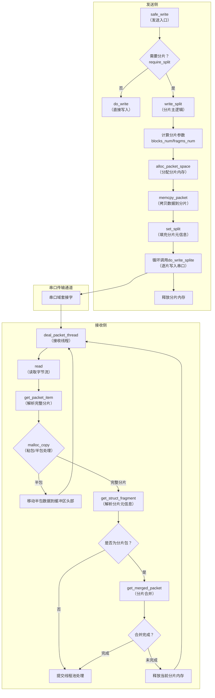

# 串口分片数据包传输模块 设计文档
## 1. 文档概述
### 1.1 文档目的
本文档详细描述**串口分片数据包传输模块**的完整设计实现，涵盖**发送侧分片写入**和**接收侧分片接收与合并**两大核心功能，包括模块架构、核心逻辑、数据流程、内存管理及错误处理机制，为模块的开发、维护、扩展和问题排查提供标准化参考。

### 1.2 模块定位
该模块运行于Linux用户态，是串口域套接字大数据包传输的核心解决方案，主要解决两大核心问题：
1. **发送侧**：大尺寸数据包单次写入超出串口MTU限制，需按固定规则分片后逐片写入，保障数据可靠传输；
2. **接收侧**：串口读取的无边界字节流存在粘包/半包问题，需解析完整分片数据包并合并，还原原始大数据包，最终提交线程池异步处理。

### 1.3 核心特性
| 特性方向 | 具体特性 |
|----------|----------|
| 发送侧 | 支持指定指令数据包的分片判断；自动计算分片参数（分片数、每片长度）；安全的分片内存分配与回滚；逐片写入串口并记录日志；完善的错误处理与资源释放 |
| 接收侧 | 处理域套接字粘包/半包问题，解析完整分片数据包；提取分片元信息（序列号、总分片数、当前分片数）；基于线程本地存储的分片合并，保证多线程安全；合并完成后自动提交线程池；全程无内存泄漏风险 |
| 通用特性 | 基于“长度前缀+数据”的数据包格式；使用安全内存操作函数（`memcpy_s`/`memmove_s`）；完善的日志记录与错误码返回；支持多线程并发传输 |

## 2. 功能需求
### 2.1 总体功能需求
| 功能类别 | 功能点 | 详细描述 |
|----------|--------|----------|
| **发送侧核心功能** | 分片判断 | 根据数据包指令类型和大小，判断是否需要分片（超过`BLOCK_MTU`限制则分片） |
| | 分片参数计算 | 自动计算总分片数、每片`struct page_block`数量、最后一片长度 |
| | 分片内存管理 | 为每个分片分配独立内存，分配失败时回滚已分配内存，避免泄漏 |
| | 分片数据填充 | 将原始数据包按分片规则拷贝到分片内存，填充分片元信息（分片数、总长度） |
| | 分片写入 | 逐片将分片数据写入串口文件，记录每片写入结果 |
| **接收侧核心功能** | 数据读取 | 持续从串口域套接字读取字节流，处理读取失败/连接关闭等异常 |
| | 粘包/半包处理 | 按“4字节长度前缀”解析完整数据包，暂存半包数据到缓冲区头部等待补充 |
| | 分片信息解析 | 从完整数据包中提取序列号、总分片数、当前分片数等元信息 |
| | 分片合并 | 基于序列号识别同数据包分片，按偏移量合并分片数据；合并完成后返回完整数据包 |
| | 异步处理 | 将合并后的完整数据包提交线程池，由`thread_entry`函数异步处理 |
| **通用功能** | 参数校验 | 对输入参数（文件指针、缓冲区、长度等）做合法性校验，非法参数直接返回错误 |
| | 错误处理 | 内存分配/拷贝/读写失败时，记录错误日志并释放已分配资源，不中断核心流程 |
| | 日志调试 | 关键节点添加日志输出，便于定位分片、合并、传输过程中的问题 |

### 2.2 双向交互流程
发送侧将大数据包分片→逐片写入串口→接收侧读取字节流→解析完整分片→合并为原始数据包→提交线程池处理，形成完整的串口分片传输闭环。

## 3. 核心设计
### 3.1 关键宏定义
| 宏名称 | 取值/说明 | 功能说明 |
|--------|-----------|----------|
| `BLOCK_MTU` | 1024 | 单个分片可承载的`struct page_block`数量上限（分片MTU），是分片的核心依据 |
| `MASK` | `BLOCK_MTU - 1`（1024） | 用于计算最后一片`page_block`数量的掩码（等价于取模运算，提升性能） |
| `BUF_LEN_MAX_RD` | 未显式定义 | 接收侧读取缓冲区最大长度，限制单次读取数据量，避免缓冲区溢出 |
| `PACKET_LEN_MAX` | 未显式定义 | 发送侧单次写入最大数据包长度，用于参数合法性校验 |
| `sizeof(uint32_t)` | 4 | 数据包长度前缀字节数，是粘包/半包解析的核心依据 |
| `_Thread_local` | 线程本地存储关键字 | 保证接收侧分片合并上下文在多线程环境下的独立性 |

### 3.2 核心数据结构（显式/推断）
| 结构体名称 | 核心字段 | 功能说明 |
|------------|----------|----------|
| **通用数据包结构** | | |
| `struct_packet_cmd_general` | `uint32_t cmd`（指令类型） `uint32_t packet_size`（数据包总长度） | 所有指令数据包的公共头部，用于识别指令类型 |
| `vm_trace_data` | `uint64_t serial_port_ptr`（串口上下文指针） `uint32_t vmid`（VM标识） | 数据包扩展头部，绑定传输上下文信息 |
| **发送侧专用结构** | | |
| `struct_packet_cmd_send_cmd` | `uint32_t fragment_block_num`（当前分片block数） `uint32_t total_fragment_block_num`（总分片block数） `uint32_t seq_num`（序列号） `uint32_t packet_size`（分片总长度） | VTZ_SEND_CMD指令分片数据包结构 |
| `struct_packet_cmd_session` | 同`struct_packet_cmd_send_cmd` | VTZ_OPEN_SESSION指令分片数据包结构 |
| `struct wr_data` | `void *wr_buf`（写入数据缓冲区） `uint32_t size_wr_buf`（缓冲区长度） | 发送侧写入数据上下文结构体 |
| **接收侧专用结构** | | |
| `struct_fragment` | `uint32_t total_fragment_block_num`（总分片block数） `uint32_t fragment_block_num`（当前分片block数） `uint32_t cmd_size`（指令头长度） `uint32_t seq_num`（序列号） | 接收侧分片元信息结构体，用于合并判断 |
| **串口上下文结构** | | |
| `struct serial_port_file` | `int sock`（域套接字描述符） `char *rd_buf`（读取缓冲区） `int offset`（半包数据偏移量） `int index`（串口索引） | 串口传输上下文结构体，存储套接字、缓冲区、状态信息 |
| **基础数据单元** | | |
| `struct page_block` | 未显式定义 | 分片数据的最小单元，分片长度基于该结构大小计算 |

### 3.3 模块整体架构

## 4. 核心函数说明
### 4.1 发送侧核心函数
#### 4.1.1 分片判断与参数计算函数
| 函数名 | 功能 | 入参/出参 | 核心逻辑 |
|--------|------|-----------|----------|
| `require_split` | 判断数据包是否需要分片 | 入参：`void *buf`（原始数据包） 返回值：`bool`（是否需要分片） | 1. 强转缓冲区为通用数据包头部，获取指令类型和总长度； 2. 判断指定指令（SEND_CMD/OPEN_SESSION）的block数据长度是否超过`BLOCK_MTU * sizeof(struct page_block)`； 3. 满足条件返回`true`，否则返回`false` |
| `get_cmd_size` | 根据指令类型获取指令头长度 | 入参：`uint32_t cmd`（指令类型） 返回值：`uint32_t`（指令头长度） | 1. 匹配指令类型（VTZ_SEND_CMD/VTZ_OPEN_SESSION）； 2. 返回对应指令结构体的长度，未知指令返回0并记录日志 |
| `get_block_size` | 计算`page_block`数据长度 | 入参：`uint32_t num`（block数量） 返回值：`uint32_t`（数据长度） | 公式：`num * sizeof(struct page_block)` |
| `get_sub_packet_size` | 计算单个分片总长度 | 入参：`cmd_size`（指令头长度）、`num`（block数量） 返回值：`uint32_t`（分片长度） | 公式：`cmd_size + get_block_size(num)` |
| `get_total_page_block_num` | 获取数据包总block数 | 入参：`void *wr_buf`（原始数据包）、`cmd`（指令类型） 返回值：`int`（总block数） | 根据指令类型强转缓冲区，读取`total_fragment_block_num`字段 |

#### 4.1.2 分片内存管理与数据拷贝函数
| 函数名 | 功能 | 入参/出参 | 核心逻辑 |
|--------|------|-----------|----------|
| `alloc_packet_space` | 为所有分片分配内存 | 入参：`void **fragments`（分片指针数组）、`nums`（分片数）、`last_num`（最后一片block数）、`cmd_size`（指令头长度） 返回值：0成功/-ENOMEM失败 | 1. 遍历分片，计算每片长度（最后一片用`last_num`，其余用`BLOCK_MTU`）； 2. 调用`kzalloc`分配内存并初始化； 3. 任意分片分配失败，回滚释放已分配内存 |
| `set_split` | 填充分片数据包元信息 | 入参：`cmd`（指令类型）、`fragment`（分片缓冲区）、`block_num`（当前分片block数） | 1. 根据指令类型强转分片缓冲区； 2. 设置`fragment_block_num`和`packet_size`字段； 3. 记录分片长度日志 |
| `copy_data` | 将原始数据拷贝到单个分片 | 入参：`wr_buf`（原始数据包）、`fragment`（分片缓冲区）、`offset`（拷贝偏移量）、`cmd_size`（指令头长度）、`block_num`（block数）、`cmd`（指令类型） 返回值：0成功/-EFAULT失败 | 1. 拷贝指令头到分片缓冲区； 2. 拷贝block数据到指令头后； 3. 更新拷贝偏移量，调用`set_split`填充分片信息 |
| `memcpy_packet` | 遍历所有分片完成数据拷贝 | 入参：`fragments`（分片数组）、`nums`（分片数）、`wr_buf`（原始数据包）、`last_num`（最后一片block数）、`cmd_size`、`cmd` | 1. 前`nums-1`个分片拷贝`BLOCK_MTU`个block； 2. 最后一个分片拷贝`last_num`个block； 3. 拷贝失败仅记录日志，不中断流程 |

#### 4.1.3 分片写入核心函数
| 函数名 | 功能 | 入参/出参 | 核心逻辑 |
|--------|------|-----------|----------|
| `do_write_splite` | 单个分片的实际写入 | 入参：`fp_serialport`（串口文件指针）、`buf`（分片缓冲区）、`buf_size`（分片长度） 返回值：0成功/内核错误码失败 | 1. 参数合法性校验（空指针/长度超限）； 2. 调用`kernel_write`写入串口； 3. 记录写入结果日志 |
| `write_split` | 分片写入主逻辑 | 入参：`fp_serialport`（串口文件指针）、`wr_buf`（原始数据包） 返回值：0成功/-ENOMEM/-EFAULT失败 | 1. 解析指令类型，计算分片参数； 2. 分配分片指针数组和分片内存； 3. 拷贝数据并填充分片信息； 4. 逐片调用`do_write_splite`写入； 5. 释放所有内存资源，处理错误 |
| `safe_write` | 发送侧入口函数 | 入参：`write_data`（写入上下文）、`fp_serialport`（串口文件指针） 返回值：0成功/-EINVAL/-EFAULT失败 | 1. 入参合法性校验； 2. 调用`require_split`判断是否分片； 3. 分片则调用`write_split`，否则直接调用`do_write` |

### 4.2 接收侧核心函数
#### 4.2.1 粘包/半包处理函数
| 函数名 | 功能 | 入参/出参 | 核心逻辑 |
|--------|------|-----------|----------|
| `malloc_copy` | 处理粘包/半包，生成完整数据包 | 入参：`buf`（读取缓冲区）、`buf_len`（总长度）、`size`（数据包长度）、`poffset`（解析偏移量） 返回值：完整包指针/NULL（半包） | 1. **半包判断**：偏移+长度>缓冲区长度 → 移动半包数据到缓冲区头部，更新偏移，返回NULL； 2. **完整包处理**：分配内存（含`vm_trace_data`头部），拷贝数据，更新偏移，返回包指针 |
| `get_packet_item` | 解析完整数据包的入口函数 | 入参：`buf`（读取缓冲区）、`buf_len`（总长度）、`poffset`（解析偏移量） 返回值：完整包指针/NULL | 1. 校验缓冲区是否解析完毕，是则重置偏移； 2. 校验剩余数据是否足够读取4字节长度前缀； 3. 读取长度前缀，调用`malloc_copy`处理完整包/半包 |

#### 4.2.2 分片信息解析与合并函数
| 函数名 | 功能 | 入参/出参 | 核心逻辑 |
|--------|------|-----------|----------|
| `get_struct_fragment` | 从数据包中提取分片元信息 | 入参：`packet`（完整分片包）、`p_frag`（分片信息结构体） 返回值：0成功/-1失败 | 1. 跳过`vm_trace_data`头部，定位实际数据包； 2. 获取指令类型，提取`total_fragment_block_num`、`fragment_block_num`、`seq_num`等字段； 3. 校验总分片数>当前分片数，非法则返回-1 |
| `get_merged_packet` | 基于序列号合并分片数据包 | 入参：`packet`（当前分片包）、`p_frag`（分片信息结构体） 返回值：合并完成的数据包指针/NULL | 1. **线程本地存储**：使用`_Thread_local`修饰合并上下文（`seq_num`/`fragment_offset`/`merged_packet`）； 2. **新包判断**：序列号不匹配 → 重置偏移，释放旧缓冲区，分配新合并缓冲区，拷贝当前分片数据； 3. **同包处理**：序列号匹配 → 拷贝block数据到合并缓冲区指定偏移，更新偏移； 4. **合并完成判断**：偏移量等于总长度 → 重置序列号，返回合并缓冲区；否则返回NULL |

#### 4.2.3 接收线程主函数
| 函数名 | 功能 | 入参/出参 | 核心逻辑 |
|--------|------|-----------|----------|
| `deal_packet_thread` | 接收线程主逻辑 | 入参：`arg`（串口上下文指针） 返回值：NULL | 1. 初始化：分配`struct_fragment`结构体，绑定CPU亲和性； 2. 主循环：持续读取串口数据，处理读取异常； 3. 解析完整分片包，提取分片元信息； 4. 分片包调用`get_merged_packet`合并，未完成则跳过； 5. 提交完整/合并后的数据包到线程池； 6. 退出时释放资源，记录日志 |

## 5. 关键流程详解
### 5.1 发送侧分片写入流程
1. **入口调用**：上层调用`safe_write`，传入待发送数据和串口文件指针；
2. **分片判断**：`require_split`检查数据包是否超过MTU限制，无需分片则直接调用`do_write`写入；
3. **参数计算**：需要分片则调用`write_split`，计算总block数、总分片数、最后一片block数；
4. **内存分配**：`alloc_packet_space`为所有分片分配内存，分配失败则返回错误；
5. **数据拷贝**：`memcpy_packet`遍历分片，调用`copy_data`拷贝原始数据，`set_split`填充分片元信息；
6. **逐片写入**：循环调用`do_write_splite`将分片写入串口，记录每片写入结果；
7. **资源释放**：写入完成后释放所有分片内存和指针数组。

### 5.2 接收侧分片接收与合并流程
1. **数据读取**：`deal_packet_thread`线程持续从串口域套接字读取字节流，写入缓冲区；
2. **粘包/半包处理**：`get_packet_item`解析缓冲区数据，读取长度前缀，`malloc_copy`处理半包数据（移到缓冲区头部）或生成完整分片包；
3. **分片信息解析**：`get_struct_fragment`从完整分片包中提取序列号、总分片数等元信息；
4. **分片合并**：
   - 若为新数据包（序列号不匹配）：重置合并上下文，分配合并缓冲区，拷贝当前分片数据；
   - 若为同数据包分片：拷贝block数据到合并缓冲区指定偏移，更新偏移量；
5. **合并完成判断**：偏移量等于总数据包长度时，合并完成，将数据包提交线程池处理；未完成则释放当前分片内存，继续读取下一分片；
6. **循环执行**：重复步骤1-5，直到线程池销毁或串口连接关闭。

## 6. 错误处理机制
### 6.1 发送侧错误处理
| 错误场景 | 触发函数 | 处理方式 |
|----------|----------|----------|
| 输入参数非法（空指针/长度超限） | `safe_write`/`do_write_splite` | 返回`-EINVAL`，记录错误日志 |
| 内存分配失败 | `alloc_packet_space` | 回滚释放已分配的分片内存，返回`-ENOMEM` |
| 数据拷贝失败 | `copy_data` | 记录错误日志，继续处理后续分片 |
| 串口写入失败 | `do_write_splite` | 记录错误码，返回内核错误码，继续写入后续分片 |
| 未知指令类型 | `get_cmd_size`/`require_split` | 记录错误日志，返回0或`false`，不进行分片 |

### 6.2 接收侧错误处理
| 错误场景 | 触发函数 | 处理方式 |
|----------|----------|----------|
| 串口上下文非法（空指针/无效FD） | `deal_packet_thread` | 记录错误日志，跳转到线程退出逻辑 |
| 域套接字读取失败（致命错误：ECONNRESET/EBADF） | `deal_packet_thread` | 记录错误日志，退出线程 |
| 域套接字读取失败（非致命错误） | `deal_packet_thread` | 记录错误日志，继续循环读取 |
| 内存分配失败 | `malloc_copy`/`get_merged_packet` | 记录错误日志，返回NULL，不中断核心流程 |
| 内存拷贝失败 | `malloc_copy` | 释放已分配内存，返回NULL，记录错误日志 |
| 分片信息解析失败（未知指令/非法分片数） | `get_struct_fragment` | 记录错误日志，返回-1，数据包直接提交线程池 |
| 合并缓冲区分配失败 | `get_merged_packet` | 记录错误日志，返回NULL，释放当前分片内存 |

## 7. 核心设计要点
### 7.1 分片传输核心设计
1. **数据包格式标准化**：采用“4字节长度前缀+指令头+page_block数据”的格式，是粘包/半包解析和分片合并的基础；
2. **分片参数计算优化**：使用`MASK`（`BLOCK_MTU-1`）替代取模运算计算最后一片长度，提升计算性能；
3. **内存分配安全**：`alloc_packet_space`函数实现内存分配回滚机制，任意分片分配失败时释放已分配内存，避免泄漏。

### 7.2 接收侧线程安全设计
1. **线程本地存储（TLS）**：`get_merged_packet`中使用`_Thread_local`修饰合并上下文变量，每个接收线程拥有独立的合并缓冲区和状态，无需加锁，保证多线程并发安全；
2. **CPU亲和性绑定**：`deal_packet_thread`调用`CPU_SET_AFFINITY`绑定线程到指定CPU核心，减少CPU调度开销，提升接收性能。

### 7.3 内存安全设计
1. **安全内存操作**：全程使用`memcpy_s`/`memmove_s`替代原生`memcpy`/`memmove`，通过长度校验避免内存越界；
2. **内存释放闭环**：所有`malloc`/`kzalloc`分配的内存，均有对应的`free`逻辑（失败时即时释放、合并完成后由线程池释放、线程退出时释放）；
3. **空指针校验**：所有指针操作前均做非空校验，避免空指针解引用导致的段错误。

## 8. 注意事项
### 8.1 内存管理注意事项
1. **发送侧**：`alloc_packet_space`分配的分片内存，需在写入完成后统一释放；分配失败时必须回滚，否则会导致内存泄漏；
2. **接收侧**：`get_merged_packet`返回的合并缓冲区，需由`thread_entry`函数负责`free`；当前分片包在合并函数内已释放，外部无需重复释放；
3. **线程退出**：`deal_packet_thread`退出时需释放`struct_fragment`结构体，避免内存泄漏。

### 8.2 分片合并边界条件
1. **序列号唯一性**：`seq_num`需全局唯一，否则会导致不同数据包的分片错误合并；
2. **分片长度校验**：发送侧填充分片`packet_size`时，需确保长度等于`cmd_size + block_num * sizeof(struct page_block)`，否则接收侧合并会出现长度不匹配；
3. **半包数据处理**：接收侧缓冲区的半包数据需通过`memmove_s`移到头部，否则下次读取的数据无法接续，导致数据包解析失败。

### 8.3 扩展性注意事项
1. **新增指令类型**：发送侧需同步修改`get_cmd_size`、`require_split`、`set_split`函数；接收侧需同步修改`get_struct_fragment`函数；
2. **调整MTU值**：修改`BLOCK_MTU`后，需重新评估发送侧分片参数计算和接收侧合并缓冲区长度计算逻辑；
3. **日志调试**：模块内置大量`zdq-x`前缀的日志，可通过日志中的`offset`/`packet_size`/`seq_num`等字段定位传输过程中的问题。